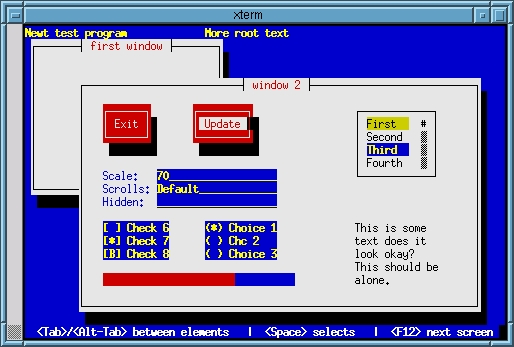
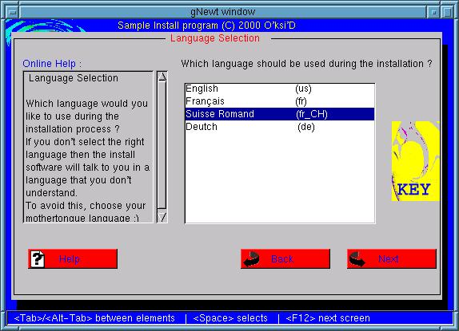
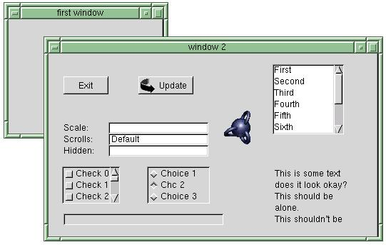

                gNewt - Gtk+ Not Erik's Windowing Toolkit

gNewt is a Newt compatible gtk+ based library. Newt was originaly written by
Erik Troan at Red Hat Software. gNewt was written by O'ksi'D.

gNewt 0.06 is compatible with newt 0.50-13.

gNewt's license is LGPL (see COPYING file for details).

If you want to develop a software which must be compatible with both gNewt and 
newt, you should use newt as the reference during the development. 

HACKING :
=========

There is 7 test programs in the gNewt source code :
	test 		: C main test program
	test_ja		: C test progaram for Japanese chars
	testgrid 	: C grid layout and dialog windows test
	testtree	: C CheckboxTree widget test
	peanuts.py	: Python gsnack module test
	testtcl.tcl	: TCL whiptcl module test
	testwhiptail.sh : shell whiptail test script

By simply setting the LD_PRELOAD environmental variable, every C, Python,
TCL or whiptail program dynamicaly linked to newt can be dynamicaly linked 
to gNewt at runtime. No need to recompile anything.
	export LD_PRELOAD=/usr/lib/libgnewt.so

But if you don't like this feature, you have another choice :

- To use an existing newt C program with gNewt, you should :
    Edit the program's Makefile. Remove the "slang" and "newt" library form
    list of library to be linked. Add the "gnewt", "gtk" and "gdk" library
    to the list of library to be linked. Recompile the program. That's it.

To override the font size, you can set the GNEWT_FONT_SIZE environmental 
variable : 
	export GNEWT_FONT_SIZE=20x8
This can be usefull to have a full screen display.

Install procedure :
===================
        tar -xvzf gnewt_0.07-1.tgz
	cd gnewt-0.07
	automake
	./configure
	make
	make install

TODO :
======
	- Destroy all widgets in newtCls() and re-create them in newtFormRun()
	- Write a short gNewt specific tutorial
	- Add an extended function to load newt or gNewt after the application
	  startup? It will avoid the use of LD_PRELOAD. The feature should be
	  optional.

